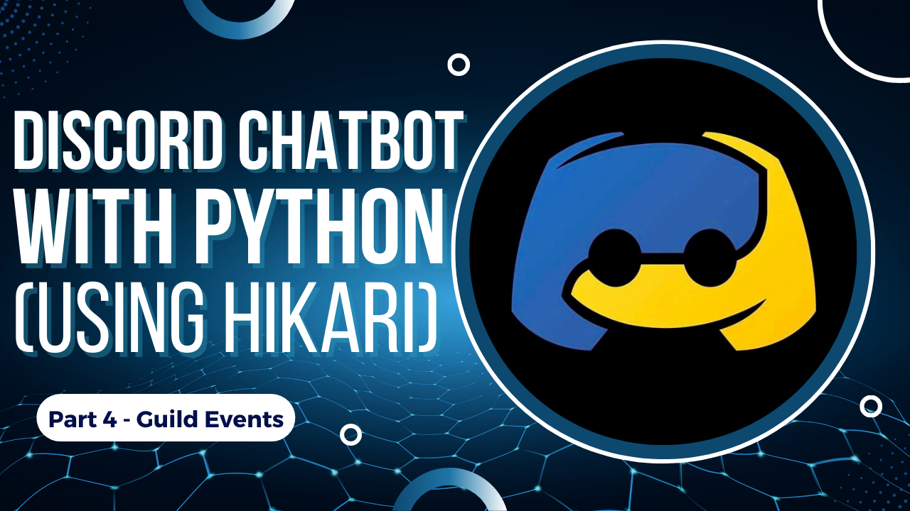

# Part 3 - Ban Events

Hey Guys! This is the Fourth episode of this series Creating a Discord Bot with Python using Hikari API. In this [video](https://youtu.be/xQSvtAhxaGI) we will be focusing on events triggered with changes made to a server or when a bot joins/leaves a server and understand their Properties.


[](https://youtu.be/xQSvtAhxaGI)


## Types of Guild Events

```python
hikari.GuildJoinEvent                 #Triggered when Bot joins a server
hikari.GuildLeaveEvent                #Triggered when Bot leaves a server
hikari.GuildUnavailableEvent          #Triggered when a server becomes Unavailable
hikari.GuildAvailableEvent            #Triggered when a server becomes Available
hikari.GuildUpdateEvent               #Triggered when details of a server are updated
hikari.EmojisUpdateEvent              #Triggered when emojis on a server are updated

```


## BanCreateEvent Properties

```python
    guild_id = event.guild_id   #Returns Unique Numeric GuildID
    shard = event.shard         #Returns Unique ShardID
    user = event.user           #Returns Username#1234
    user_id = event.user_id     #Returns Unique Numeric UserID

```

## BanDeleteEvent Properties

```python
    
    guild_id = event.guild_id   #Returns Unique Numeric GuildID
    shard = event.shard         #Returns Unique ShardID
    user = event.user           #Returns Username#1234
```

## Resources

[Hikari Documentation for Ban Events](https://www.hikari-py.dev/hikari/events/guild_events.html#hikari.events.guild_events.BanEvent)
Read the docs for better understanding of the code.

[Discord Developer](https://discord.com/developers/applications)
Create your very own Discord Bot here!

## License

[MIT](https://github.com/kshgr/Discord-Bot-with-Python-using-Hikari/blob/main/LICENSE)
